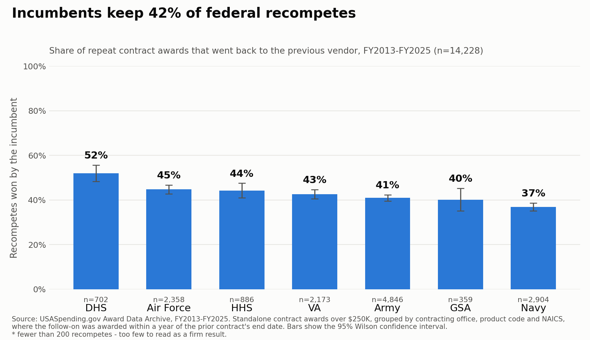

# Does the Incumbent Usually Win the Recompete?

Measures how often the same vendor keeps a federal contract when it comes up for
renewal, broken out by agency, using public contract award data.

**Data:** USASpending.gov Award Data Archive
**Scope:** FY2013-FY2025, seven agencies - Navy, Army, Air Force, DHS, VA, GSA, HHS
**Tools:** Python, pandas, matplotlib, statsmodels.

---

## Findings

**Incumbents keep 41.7% of standalone recompetes** (n=14,228, FY2013-FY2025).

| Agency | Retention | Recompetes |
|---|---:|---:|
| DHS | 52% | 702 |
| Air Force | 45% | 2,358 |
| HHS | 44% | 886 |
| VA | 43% | 2,173 |
| Army | 41% | 4,846 |
| GSA | 40% | 359 |
| Navy | 37% | 2,904 |



DHS is the stickiest agency for incumbents - just over half its recompetes go back to the
same vendor. Navy is the most open to new vendors - the incumbent loses almost two-thirds
of the time. Air Force, HHS, and VA sit in the middle, all within a few points of 43-45%.
Army and GSA land close to the overall average of 42%.

The stretch logistic regression (`outputs/logit_summary.txt`) finds award size and agency
both statistically significant: a 10x larger contract raises the odds of retention about 8%
(p=0.009), and DHS retains at 1.57x the odds of the Army baseline (p<0.001) while Navy sits
at 0.85x (p<0.001). Contract pricing type - Fixed Price vs. Cost Plus vs. T&M - shows no
significant effect once agency and size are controlled for.

---

## How to run it

Open `incumbent_recompete.ipynb` in Google Colab and Run All. It will:

1. Mount Drive and download the five agency archives for thirteen fiscal years
2. Cache a slimmed parquet copy of each agency-year to Drive
3. Build the retention table, the chart, the size breakdown, and the regression

The download is resumable. Each agency-year is cached separately and skipped if it
already exists, so a Colab disconnect costs only the file that was in flight, not the run.

It can also be run locally as `python pipeline.py`; it detects the absence of Colab and
caches to `./slim` instead of Drive.

USASpending rate-limits sustained downloading and will start refusing connections after a
few GB from a residential IP. The retry logic backs off up to eight minutes to ride that
out. Colab does not hit this.

---

## Method

### The core problem

USASpending has no "recompete" field. Nothing links an expiring contract to the one that
replaces it - no flag, no predecessor ID, no marker of any kind. The analysis reconstructs
that link from circumstantial evidence.

The proxy: the same contracting office buying the same product or service code again, near
the point where the previous contract ran out. If the winner is the same as last time, the
incumbent was retained.

```
Navy office N00024, PSC R425 (engineering support)
  2019-06  ->  Vendor A     contract runs to 2022-06
  2022-05  ->  Vendor A     incumbent retained
               Vendor B     incumbent lost
```

### Why the timing filter matters

Grouping only on agency, office, and product code overcounts recompetes. A contracting
office buys many unrelated things under a single product code, so the next award in that
group is usually a different requirement, not a follow-on to the last one. Counting those
as losses depresses the retention rate for reasons unrelated to anyone winning or losing.

A pair counts as a recompete only if the follow-on lands within a year of the prior
contract's potential end date (`LINK_WINDOW_D`). A genuine successor is awarded as the old
contract expires; an award five years off that mark is unrelated work.

The headline table uses this filter. `retention_by_agency_unlinked.csv` reports the
unfiltered version, so the effect of the filter is visible rather than buried.

### Filters, and why each one is there

| Filter | Why |
|---|---|
| `modification_number` is all zeros | Rows are transactions, not awards. Roughly 85-90% are modifications to contracts that already exist. Without this filter, every modification counts as a fresh competition. |
| `award_or_idv_flag == 'AWARD'` | Drops IDV vehicle establishments, which are a different question. |
| `parent_award_id_piid` blank | Drops delivery orders and BPA calls under an existing vehicle. Orders under a single-award IDIQ go to the incumbent by construction, so including them pushes retention toward 100% for a reason unrelated to winning. |
| `value >= $250K` | Roughly the simplified acquisition threshold. Micro-purchases are not "recompeted." |
| Awards within 180 days collapse into one event | A contracting office can award several contracts for the same code on the same day. Treating those as a sequence would manufacture fake losses. The incumbent becomes a set of vendors, and a later award counts as retained if it intersects that set. |

Contract value is `potential_total_value_of_award`, falling back to current value then
obligation. Base-award rows often obligate only a first increment, so obligation alone
understates contract size.

Vendor identity is `recipient_parent_uei`, so a subsidiary re-winning its parent's work
counts as retention rather than a loss.

### Dataset notes

1. `type_of_contract_pricing_code` and `extent_competed_code` hold the description, not
   the letter code - the opposite of what the suffix suggests. The bare columns
   (`type_of_contract_pricing`, `extent_competed`) hold the letter. `award_type_code` is
   the other way round. An assertion in the pipeline guards this.
2. Navy, Army, and Air Force have no separate archive files. They are sub-agencies inside
   the single DoD file (toptier code 097), split out via `awarding_sub_agency_name`.
3. UEI is populated across the full range; DUNS is not. UEI is used as the vendor key
   throughout - no DUNS fallback, no name matching.

Archive URLs are not stable strings - the date suffix changes each time USASpending
regenerates the files - so the pipeline requests the current URL from the API rather than
hardcoding one.

---

## Verification

`python test_pipeline.py` runs offline in about ten seconds. It builds 280 synthetic
two-award sequences where 2 in 3 keep the incumbent and 1 in 10 has its follow-on placed
far from the prior end date, then asserts the pipeline recovers exactly those counts:

```
linked pairs   expected  252  got  252  OK
retained       expected  168  got  168  OK
logit converged  OK
known-answer test PASSED
```

Retention counting is the core of this analysis, so it is checked against data whose
answer is known in advance rather than read off real data where nobody knows the right
answer.

The notebook's final cell also checks against real data: that the pricing column contains
words rather than letter codes, that vendor-key coverage exceeds 99%, and that every
published agency has at least 200 recompetes behind its bar.

---

## Limitations

- **The recompete link is inferred, not observed.** Office, product code, and timing are
  the best proxy available in free public data. It will mislabel some awards in both
  directions - unrelated buys counted as recompetes, and genuine recompetes missed because
  the successor was awarded under a different office or product code.
- **Vehicle orders are excluded.** A large share of federal buying happens as orders under
  IDIQs and GWACs. This measures standalone contract awards only.
- **FY2013-FY2025 only.** A contract awarded before FY2013 has no visible predecessor
  here, so its recompete is dropped rather than counted.
- **Contracts that lapsed and were never rebid are invisible.** The data only shows
  awards that happened.
- **This measures whether the incumbent kept the work, not why.**

## Source

USASpending.gov Award Data Archive - <https://www.usaspending.gov/download_center/award_data_archive>
